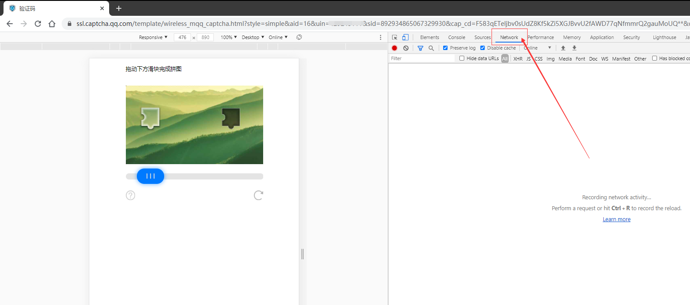
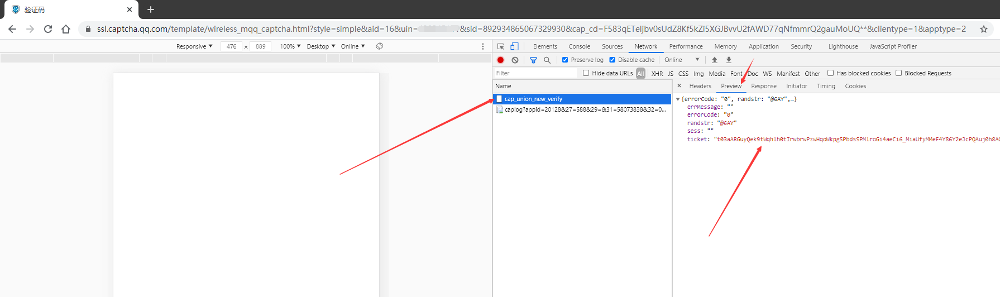

# 杂七杂八

::: tip 说明
这里有使用时的其他说明和教程
:::
[[toc]]

## 划动验证码和设备锁

### **滑动验证码**

> 陌生设备登录时可能会出现滑动验证码，同一设备只需通过一次

收到滑动验证提示后：

1. **用chrome浏览器访问给出的url，并打开F12->Network (网络)**

2. **滑动后会发一个请求，从响应中取出ticket**

3. **调用 `client.sliderLogin(ticket)` 即可成功登录**

::: tip 提示
ticket输入错误会报环境异常，重复上述过程即可  
若ticket输入正确仍然环境异常，可考虑使用扫码登录。或安装：[腾讯滑动验证码助手](https://github.com/mzdluo123/TxCaptchaHelper/releases) 中的apk，在安卓真机上滑动后得到ticket
:::

----

### **设备锁**

::: warning 注意
无论是否开启设备锁，在陌生设备登录都有可能会要求通过验证  
可以调用SMS接口发短信验证，也可以访问给出的url扫码  
:::

**扫码(默认)：** 打开验证地址url完成扫码即可。

**短信验证：**

```js{2,4}
client.on("system.login.device", function () {
  this.sendSMSCode() //发送短信
  process.on("data", (input) => {
    this.submitSMSCode(input) //提交短信验证码
  })
})
```

::: tip 提示
首次登录会创建一个device.json设备文件  
验证完成后此设备文件长期有效
:::

## 其他常见问题

### 提示：群消息发送失败，请检查消息内容

> 有些账号使用新设备可能会被风控，需要挂机几小时到几天不等。  

### 提示：当前上网环境异常

> 使用扫码登录  
> 或安装：[腾讯滑动验证码助手](https://github.com/mzdluo123/TxCaptchaHelper/releases) 中的apk，在安卓真机上滑动后得到ticket

### 提示密码已泄露，被强制下线要求修改密码

> 异地登录的原因，请打开设备锁。  

### 无法设置在线状态、无法接收某些群事件(包括戳一戳等)

> aPad和手表协议不支持这些功能，需切换到其他登录协议。

### 其他莫名其妙的问题，如收不到群消息、收不到加群申请等

> 先使用官方客户端确认该号是否存在同样问题，若为本程序问题可在issue中反馈。

### 只能接收群聊消息，无法接收私聊消息和群邀请

> 请检查你的系统时间是否快了1分钟以上

----

## 快速构造多元素消息

::: tip 提示
一条消息中可能包含多个元素节点  
下面的例子是：一条文本+一张图片+一个表情
:::

```js
// 使用工具函数快速构建
const { segment, cqcode } = require("oicq");

// 纯字符串形式(CQ码)
let message = "hello world" + cqcode.image("C:/tmp/abc.jpg") + cqcode.face(104);
// -> "hello world[CQ:image,file=/tmp/abc.jpg][CQ:face,id=104]"

// 数组消息链形式
let message = [
  segment.text("hello world"),
  segment.image("C:/tmp/abc.jpg"),
  segment.face(104),
];

// 手动构造数组消息链
let message = [
    {
        type: "text",
        data: {
            text: "hello world"
        }
    },
    {
        type: "image",
        data: {
            file: "/tmp/abc.jpg"
        }
    },
    {
        type: "face",
        data: {
            id: 104
        }
    },
]
```

----

### 什么是CQ码？

CQ码是指纯字符串格式下用于表示多媒体内容的方式，形如：  
`[CQ:image,file=123.jpg]`  
`[CQ:at,qq=123456]`  
常用的有at、表情、图片、语音、音乐等。  
因此混在字符串中的CQ码，以下字符会被转义：`[]&,`  
推荐使用数组格式的消息链，可以避免转义操作。  
如果你一定要使用CQ码，可使用`cqcode`内的函数，尽量不要手动拼接

|[CQ码]|收|发|说明|
|:-:|:-:|:-:|-|
|at|◯|◯|[CQ:at,qq=123456]|
|face|◯|◯|[CQ:face,id=104]|
|bface|◯|◯|原创表情，[CQ:bface,file=xxxxxxxx,text=摸头]|
|dice&rps|◯|◯|骰子和猜拳：<br>[CQ:dice,id=1]<br>[CQ:rps,id=1]|
|image|◯|◯|本地图片：[CQ:image,file=/tmp/123.jpg]<br>网络图片：[CQ:image,file=http://domain.com,cache=1]<br>图片还支持base64格式和Buffer|
|record|◯|◯|语音，写法同image|
|flash|◯|◯|闪照，写法同image|
|anonymous||◯|发匿名，[CQ:anonymous,ignore=1]<br>ignore为0时匿名失败不发送|
|file|◯||文件|
|music|json|◯|[CQ:music,type=qq,id=xxxxxx]<br>type支持`qq` `163` `kuwo` `kugou` `migu`|
|location|json|◯|[CQ:location,address=江西省九江市修水县,lat=29.063940,lng=114.339610]|
|reply|◯|◯|引用回复 [CQ:reply,id=xxxxxx]
|shake|◯|◯|[CQ:shake]
|poke|◯|◯|[CQ:poke,type=6] 暂时支持0~6，可以在群里发
|xml&json|◯|◯|可用于接收群公告等消息。封杀比较严重，不推荐发原生。
|share|xml|◯|链接分享
|video|◯|◯|[CQ:video,file=xxxxxx]
|node||◯|合并转发[CQ:node,id=xxxxxx]|
|mirai|◯|◯|[CQ:mirai,data=xxxxxx] 只有mirai系的客户端可以识别此消息|

----

### 关于语音

::: tip 提示
QQ支持的原生格式为amr或silk  
内置将mp3等格式自动转为amr，需要自行安装 [ffmpeg](http://ffmpeg.org/download.html) 加入环境变量  
linux下的构建版可以在 <https://johnvansickle.com/ffmpeg> 下载（自带amrnb）  
群语音无法直接转发到私聊，私聊语音也无法直接转发到群和其他私聊
:::

#### **语音的其他解决方案(自行转码到silk，音质高于amr)**

[wx-voice @Ang-YC](https://github.com/Ang-YC/wx-voice)

[silk-sdk @laysent](https://github.com/laysent/silk-sdk)

## message_id的规则和解析方法

发送和接收到消息都可以得到一个消息ID。  
由于core中不使用数据库，所以将一些可能使用到的数据存入消息id以统一和简化API。  

### 群消息id规则

群消息id总共21字节，使用base64编码保存，字符串长度为21/3*4=28

| 群号(int32) | 发送者QQ(int32) | 消息编号(int32) | 随机数(int32) | 时间戳(int32) | 分片数(int8) |
|:-:|:-:|:-:|:-:|:-:|:-:|
|gid|uid|seqid|random|timestamp|pktnum|

### 私聊消息id规则

私聊消息id总共17字节，使用base64编码保存，字符串长度为18/3*4=24

| 对方QQ(int32) | 消息编号(int32) | 随机数(int32) | 时间戳(int32) | 发送flag(int8) |
|:-:|:-:|:-:|:-:|:-:|
|uid|seqid|random|timestamp|flag

::: tip 提示
发送flag: 发的消息为1，收的消息为0
:::

### 解析消息id

```js
var parsed = Buffer.from(message_id, "base64");
var gid = parsed.readUInt32BE(parsed);
var uid = parsed.readUInt32BE(parsed, 4);
var seqid = parsed.readUInt32BE(parsed, 8);
```

目前使用到消息id的地方：

* deleteMsg (撤回消息)
* getMsg (获取历史消息)
* [CQ:reply] (回复)
* [CQ:node] (转发)

::: tip 提示
一般对于群来说，seqid由服务器管理，不会重复。  
私聊的seqid非服务器管理，可能会重复。  
:::

## 关于账号冻结和风控

### 是否会因为使用开源的第三方QQ协议实现而被tx封号？

> **目前不会，但是不能保证未来也一直不会。**

### 可能会导致封号的原因

1. 被举报（不管你有没有发违规消息都有几率被封）。
2. 新号私聊发链接，或发其他过于奇怪的内容。
3. 不开设备锁在异地登录陌生设备（一段时间后提示密码泄露被强制下线）。
4. 使用某些xposed插件。

### 风控（被tx暗中限制某些功能）

* 长消息必须分片发送才能成功。
* 更换设备后，可能在最长几天之内都无法发送超过2个字节的群消息。
* 可能无法发送合并转发，以及一些xml消息。
* 可能被一定程度限制加群、加好友以及邀请入群的功能（可能进入过滤列表，或直接收不到）。
